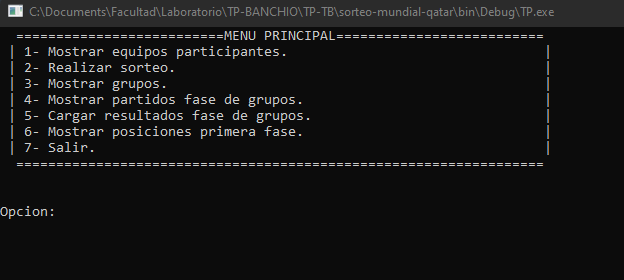

# sorteo-mundial-qatar
Aplicación de consola que simula un telemedia para el mundial de Qatar.
Sortea los grupos, confecciona los partidos, carga y edita resultados y muestra posiciones finales. 

Proyecto final de laboratorio de computacion I - UTN. 
